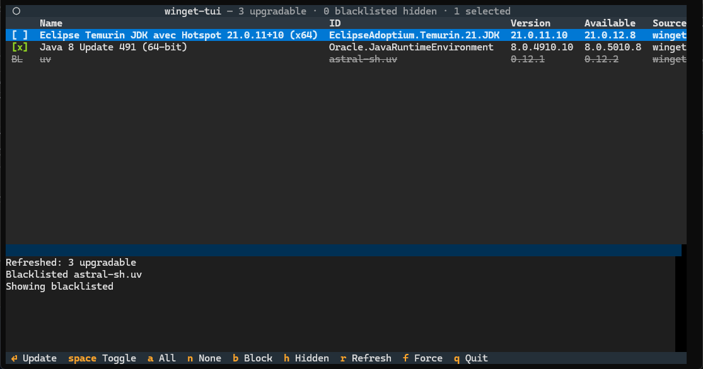

# winget-tui

A small TUI + CLI over [winget](https://learn.microsoft.com/windows/package-manager/)
for listing upgradable packages, deselecting some before updating, and
persisting a blacklist of packages that are never offered.

The list is parsed from winget's human-readable table, so it works regardless
of your winget locale.



## Install

No Python needed: download `winget-tui.exe` from the
[latest release](https://github.com/JulienMaille/winget-TUI/releases/latest),
put it anywhere (e.g. a folder on your PATH) and run it. The executable is
built with PyInstaller and bundles Textual/Rich.

Alternatively, install from source with Python 3.10+:

```bash
python -m pip install git+https://github.com/JulienMaille/winget-TUI.git
```

This puts the `winget-tui` command on your PATH.

To rebuild the executable after source changes:

```bash
python -m pip install pyinstaller textual
pyinstaller --clean winget-tui.spec   # produces dist/winget-tui.exe
```

Releases are built automatically from the `v*` tags (see
`.github/workflows/build.yml`). The executable is not code-signed, so Windows
SmartScreen may warn on first run: choose *More info → Run anyway*.

## Usage

```bash
winget-tui               # interactive TUI
winget-tui list          # print upgradable packages (blacklist filtered) to stdout
winget-tui blacklist add <package-id>
winget-tui blacklist remove <package-id>
winget-tui blacklist list
```

## TUI keys

| Key | Action |
|-----|--------|
| `click` | select the clicked row (toggle its checkbox) |
| `space` | toggle selection on the cursor row |
| `a` | select all visible rows |
| `n` | clear selection |
| `b` | blacklist / un-blacklist the cursor row |
| `h` | show / hide blacklisted rows |
| `r` | refresh the list |
| `f` | toggle force mode (updates run with `winget --force`) |
| `enter` | start the update of all selected rows |
| `q`, `ctrl+c` | quit |

The header shows live counts (`18 upgradable · 0 blacklisted hidden · 3
selected`). During an update the main area becomes a full-height log streaming
winget's output, and the list auto-refreshes when it finishes.

## Blacklist

File: `%LOCALAPPDATA%\winget-tui\blacklist.txt`, one package ID per line
(`#` comments allowed). Blacklisted rows are hidden by default; press `h` to
view and un-blacklist them.

## Notes

Updates run `winget upgrade <id> ...` for each selected package with
`--silent` and the package/source agreements accepted (see winget's own
manifest for the agreements).

Failures are visible in the streamed log, not
suppressed. Machine-scope installers may show a Windows UAC prompt: that is
winget's own behavior; run `winget-tui` as Administrator to avoid the prompts.

If a Portable package's files were changed outside winget (e.g.
a manual zip extraction over the install dir), winget refuses to replace them
and the update ends with an error mentioning `--force` / press `f` to re-run
in force mode. On failure the status line repeats winget's last message, so
the reason stays visible after the log is restored.